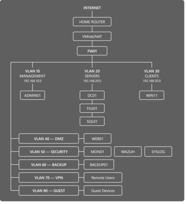

# Home Lab Infrastructure

Personal infrastructure lab focused on system administration,
networking, virtualization and automation.

## Technologies

- Windows Server
- Active Directory
- Linux
- Docker
- VMware
- PowerShell
- Bash
- Python
- Networking
- Monitoring

## Architecture

## Documentation

- [Architecture](docs/architecture.md)
- [Network](docs/network.md)
- [Active Directory](docs/active-directory.md)
- [Linux](docs/linux.md)
- [Docker](docs/docker.md)
- [Monitoring](docs/monitoring.md)
- [Backup](docs/backup.md)

## Automation

PowerShell and Bash scripts used to automate
common administration tasks can be found in `/scripts`.

## Purpose

This project is a personal educational lab used to
develop practical system administration and infrastructure skills.