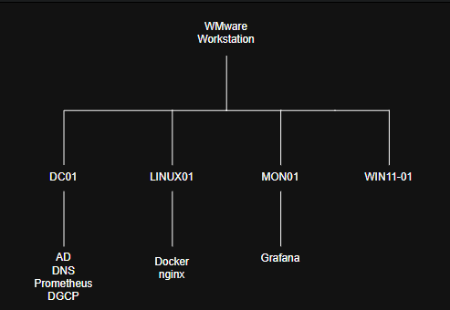

# Architecture

## Overview

This lab simulates a small enterprise IT environment
running entirely on VMware Workstation.

## Virtual Machines

| Hostname | OS | Role |
|---|---|---|
| DC01 | Windows Server | AD, DNS, DHCP |
| LINUX01 | Ubuntu Server | Docker, Nginx |
| WIN11-01 | Windows 11 | Domain client |
| MON01 | Ubuntu Server | Monitoring |

## Virtualization

All virtual machines run on VMware Workstation.

## Network

The lab uses an isolated virtual network:
192.168.10.0/24

## Diagram

## Design Decisions

The environment is intentionally isolated from the
home network to allow testing without affecting
production devices.